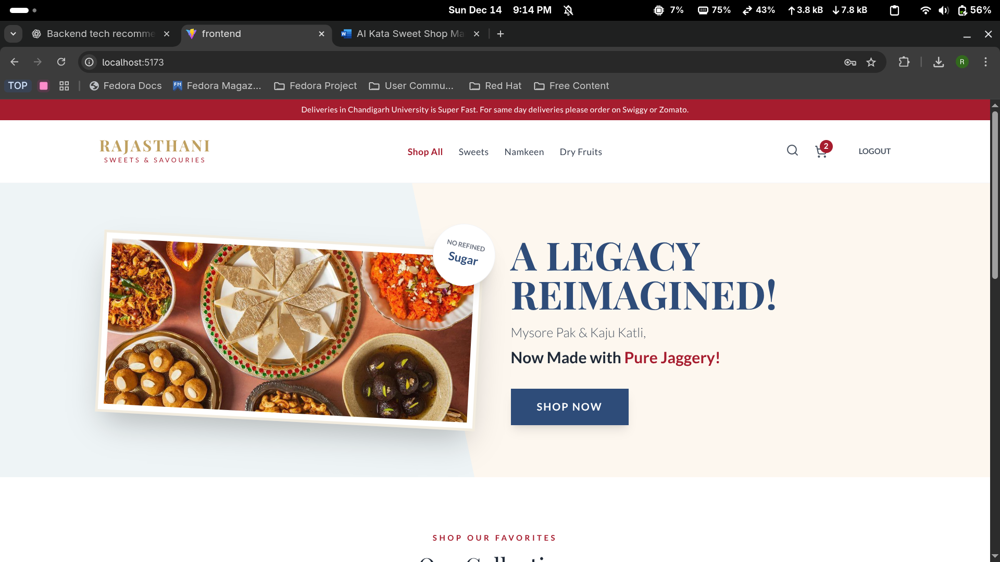
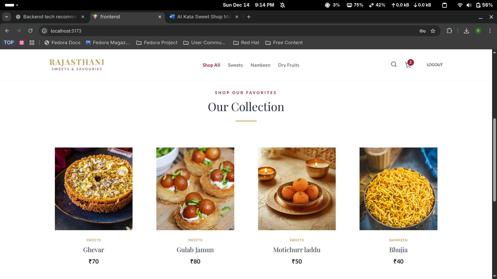
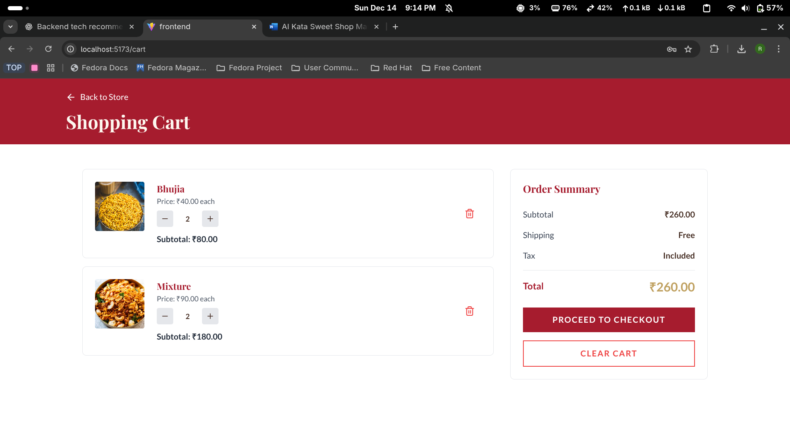
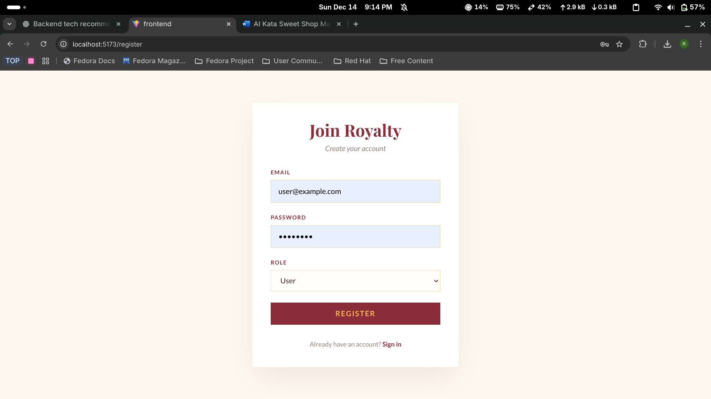
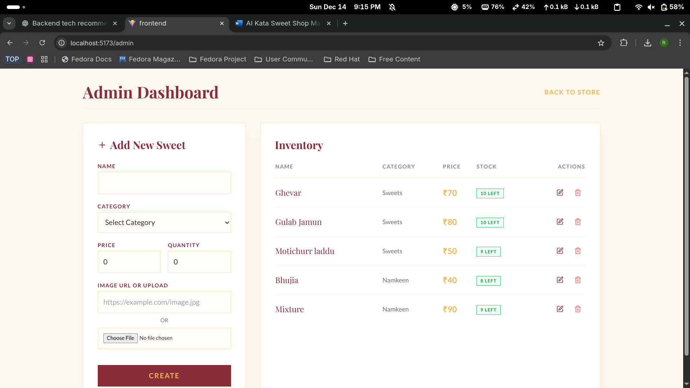
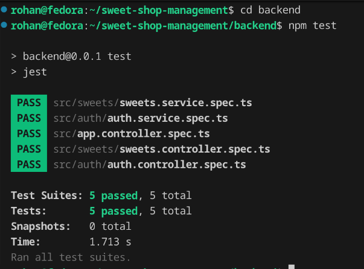

# Sweet Shop Management System

## Overview
The Sweet Shop Management System is a full-stack web application designed to manage
sweets inventory, user authentication, and purchase operations. The project was built
as part of a TDD-focused kata to demonstrate backend API design, database integration,
frontend development, clean coding practices, and responsible usage of AI tools.

The system supports role-based access control, allowing regular users to browse and
purchase sweets, while admin users can manage inventory.
## Tech Stack

### Backend
- Node.js
- TypeScript
- NestJS
- PostgreSQL
- Prisma ORM
- JWT Authentication
- Jest & Supertest (Testing)

### Frontend
- React
- TypeScript
- Vite
- Axios
- CSS / Tailwind (if used)

### Tools
- Git & GitHub
- GitHub Copilot
- ChatGPT
- Antigravity
- Warp Terminal
## Features

### Authentication
- User registration and login
- JWT-based authentication
- Secure password hashing
- Role-based access control (USER / ADMIN)

### Sweets Management
- View all available sweets
- Search sweets by name, category, or price range
- Admin-only CRUD operations for sweets

### Inventory Management
- Purchase sweets (stock decreases)
- Prevents purchasing when stock is insufficient
- Admin-only restocking functionality

### Frontend
- Responsive single-page application
- Dashboard displaying available sweets
- Disabled purchase button when quantity is zero
- Admin-only UI elements hidden from regular users
## API Endpoints

### Auth
- POST `/api/auth/register`
- POST `/api/auth/login`

### Sweets (Protected)
- POST `/api/sweets` (Admin only)
- GET `/api/sweets`
- GET `/api/sweets/search`
- PUT `/api/sweets/:id` (Admin only)
- DELETE `/api/sweets/:id` (Admin only)

### Inventory (Protected)
- POST `/api/sweets/:id/purchase`
- POST `/api/sweets/:id/restock` (Admin only)
## Setup Instructions

### Prerequisites
- Node.js (v18+ recommended)
- PostgreSQL
- Docker (optional, for PostgreSQL)
- Git

### Backend Setup
* To run backend tests:
```
   bash
   cd backend
   npm install
```
## Screenshots

 

 

 



 

